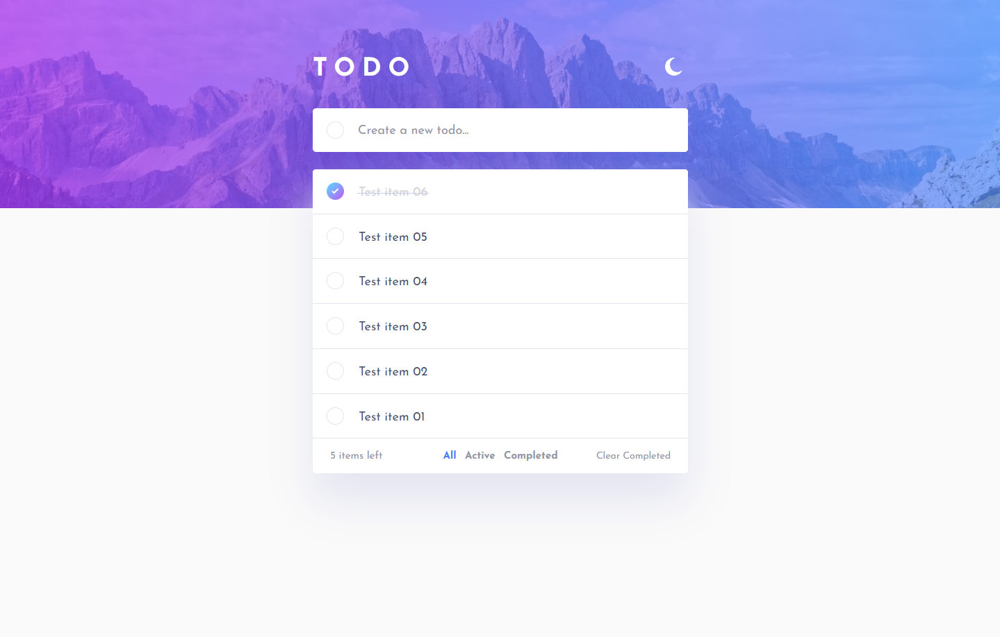

# Frontend Mentor - Todo app solution

This is a solution to the [Todo app challenge on Frontend Mentor](https://www.frontendmentor.io/challenges/todo-app-Su1_KokOW). Frontend Mentor challenges help you improve your coding skills by building realistic projects. 

## Table of contents

- [Overview](#overview)
  - [The challenge](#the-challenge)
  - [Screenshot](#screenshot)
  - [Links](#links)
- [My process](#my-process)
  - [Built with](#built-with)
  - [What I learned](#what-i-learned)
  - [Continued development](#continued-development)
  - [Useful resources](#useful-resources)
- [Author](#author)

## Overview

### The challenge

Users should be able to:

- View the optimal layout for the app depending on their device's screen size
- See hover states for all interactive elements on the page
- Add new todos to the list
- Mark todos as complete
- Delete todos from the list
- Filter by all/active/complete todos
- Clear all completed todos
- Toggle light and dark mode
- See flash messages during CRUD operations.

Updates that I plan to implement in the future:

- **Bonus**: Drag and drop to reorder items on the list
- Save active filter in local storage
- User registration
- Smooth transitions when adding or removing items
- Better looking confirmation modals on delete action

### Screenshot

### Links

- Solution URL: [Add solution URL here](https://your-solution-url.com)
- Live Site URL: [Add live site URL here](https://imwebdev.in.rs/apps/todo-app-frontend/)

## My process

### Built with

- Semantic HTML5 markup
- CSS custom properties
- Flexbox
- CSS Grid
- Desktop-first workflow
- [React](https://react.dev/) - JS library
- [Express](https://expressjs.com/) - React framework

### What I learned

Working with CRUD operations, connecting mysql database, basics of api creation in express, basic and advanced react concepts (creating components, passing props, context api, working with states in different ways), deploying react application and express backend live and a lot more...

### Continued development

- CSS
- REACT
- EXPRESS
- MYSQL

### Useful resources

- [Learn JavaScript: Full-Stack from Scratch](https://www.udemy.com/course/learn-javascript-full-stack-from-scratch)
- [React For The Rest Of Us](https://www.udemy.com/course/react-for-the-rest-of-us)

**Note: These are paid courses from udemy.**

## Author

- Website - [Ivan Mirković](https://imwebdev.in.rs)
- Frontend Mentor - [@imd94](https://www.frontendmentor.io/profile/imd94)